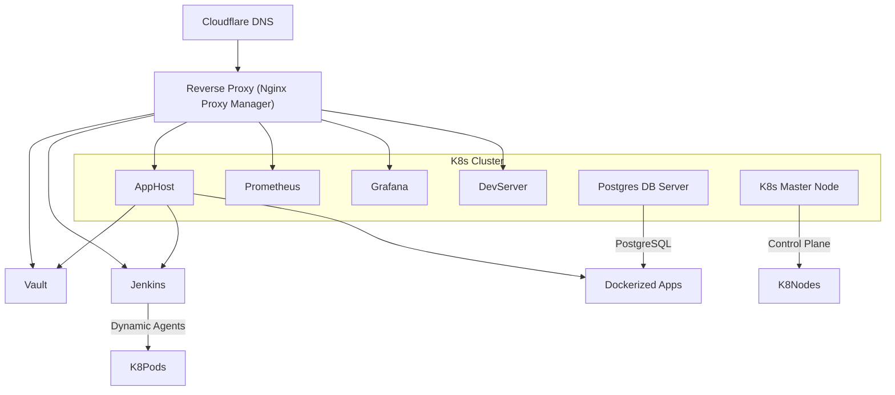

# 🧪 DevOps HomeLab on Proxmox

Welcome to my **DevOps HomeLab**, a fully automated, production-grade infrastructure built from the ground up to showcase my skills in **infrastructure automation**, **Kubernetes**, **CI/CD**, and **observability**. Everything runs on local virtual machines hosted in **Proxmox**, with complete **Infrastructure as Code (IaC)** using **Terraform** and **Ansible**.

---

## 🛠️ Tech Stack Overview

| Area                | Technology Stack                                                                 |
|---------------------|-----------------------------------------------------------------------------------|
| Hypervisor          | [Proxmox VE](https://www.proxmox.com/proxmox-ve)                                 |
| Infrastructure IaC  | [Terraform](https://www.terraform.io/), [Ansible](https://www.ansible.com/)      |
| VM Base Image       | Custom-built Ubuntu cloud-init compatible image                                  |
| Container Orchestration | [Kubernetes](https://kubernetes.io/docs/setup/production-environment/tools/kubeadm/)  |
| Containers & Apps   | [Docker](https://www.docker.com/), Custom apps, [Vault](https://www.vaultproject.io/), [Jenkins](https://www.jenkins.io/) |
| Monitoring & Observability | [Prometheus](https://prometheus.io/) + [Grafana](https://grafana.com/) via [Helm Charts](https://helm.sh/) |
| CI/CD Pipelines     | [Jenkins](https://www.jenkins.io/) with K8s agents                |
| DNS & Reverse Proxy | [Cloudflare](https://www.cloudflare.com/), [Nginx Proxy Manager](https://nginxproxymanager.com/) |
| Secrets Management  | [Vault](https://www.vaultproject.io/)                                             |
| Database            | [PostgreSQL](https://www.postgresql.org/)                                        |

---

## 🧱 Architecture Diagram



---

## 🧩 Virtual Machines & Roles

Every Proxmox VM in the environment is built from a **custom Ubuntu cloud image**, optimized for automation and security. Provisioning and configuration is entirely handled via **Terraform** and **Ansible**. All infrastructure is declarative and reproducible, which speeds up the deployment process.

### `k8master` — Kubernetes Control Plane  
- Hosts the K8s control components (API Server, Scheduler, Controller Manager)
- Manages worker nodes and scheduling of workloads

### `db-server` — PostgreSQL  
- Centralized database for all services and apps
- To be upgraded to **HA multi-node** setup

### `apphost` — Application Host  
- Hosts containerized applications with Docker  
- Runs key services:
  - **Vault** for secret management  
  - **Jenkins** with **Kubernetes-based dynamic build agents**
  - Custom-built Docker containers for hosted applications

### `develop` — Development Server  
- Sandbox environment for coding, testing, and DevOps experiments

### `reverse-proxy` — Nginx Proxy Manager  
- Public-facing reverse proxy with SSL termination
- Auto-configured to route Cloudflare traffic to internal services

---

## ⚙️ Infrastructure Automation

- **Terraform** provisions VMs in Proxmox using cloud-init
- **Ansible** configures OS, Docker, K8s, monitoring, apps, and more
- Role-based playbooks for:
  - Kubernetes setup (kubeadm)
  - Docker & containerized services
  - Prometheus + Grafana via Helm charts
  - CI/CD and Vault integration

---

## 🚀 Jenkins with Kubernetes Agents

- Jenkins runs on `apphost` and uses Kubernetes to dynamically provision **build agents as pods**
- Each agent pod is based on a **custom Docker image** with required tools (Docker CLI, Ansible, Python, etc.)
- Pipelines build, test, and deploy apps and infrastructure using GitHub integration

```yaml
# Jenkins Kubernetes plugin configuration snippet
kubernetes {
            yaml '''
                apiVersion: v1
                kind: Pod
                spec:
                  containers:
                  - name: shell
                    image: tamhid/jenkins-agent:latest
                    command:
                    - sleep
                    args:
                    - infinity
            '''
            defaultContainer 'shell'
            retries 2
        }
```

---

## 📈 Monitoring & Observability

- **Prometheus** and **Grafana** are deployed via official **Helm charts**
- Prometheus scrapes metrics from nodes, pods, and services
- Grafana provides dashboards for:
  - Node health
  - K8s cluster status
  - CI/CD metrics
- All configured automatically via Ansible

---

## 🔐 Secrets & DNS Automation

- **Vault** stores application secrets and TLS certs securely
- **Cloudflare** manages external DNS
- **Nginx Proxy Manager** acts as the gateway for incoming traffic

### 🔄 Reverse Proxy Automation Challenge

Since **Nginx Proxy Manager** lacks a usable API, I wrote a **custom Python script** to automate DNS + SSL record creation:
- Directly inserts reverse proxy config data into the **SQLite** DB
- Generates config files from a Jinja2 template
- Restarts NPM service to apply changes

➡️ [View script here](./deployment-pipelines/deploy-applications/ansible/python/update_reverse_proxy.py)

---

## 🧰 Custom-Built Applications

I’ve developed and deployed several apps to showcase full-stack and DevOps skills. These are containerized, automatically deployed via Jenkins, and hosted on the `apphost` server.

### 📄 [Resume App](#)  
A sleek, single-page **React** application that displays my resume.  
- Built with React and styled with Tailwind CSS
- Deployed as a Docker container
- Available via the reverse proxy with SSL

### 🧾 [Inventory App](#)  
A **Flask API** that returns VM metadata (VMID, name, IP) for all Proxmox VMs.  
- Uses **PostgreSQL** to persist VM info  
- Queries the Proxmox API for live data  
- Deployed as a microservice and used for debugging/automation

### 📅 [Man Utd Fixture App](#)  
Downloads and parses Manchester United’s fixture calendar file (.ics), stores it in PostgreSQL, and exposes a clean **REST API** using **Flask**.  
- Python parser for `.ics` files  
- Flask API with search/filter endpoints  
- Deployed as a Docker container and updated via CI

➡️ All apps run in Docker containers and are deployed to the **apphost** server via Jenkins pipelines.

---

## 🔧 Python Libraries & Automation Scripts

To streamline DevOps workflows and integrate third-party services, I’ve created a set of reusable Python libraries:

### 🛡️ Vault API Wrapper

A Python module that interacts with **HashiCorp Vault** via its REST API:

- Authenticate using token
- Retrieve secrets by path
- Add/update secrets programmatically
- Used across CI pipelines and internal applications to manage sensitive data

➡️ [View script here](./lib/hvac_lib.py)

The libraries are modular and designed for reuse across the homelab ecosystem and Jenkins jobs.


## 🧭 Future Improvements

- ⚙️ Deploy **PostgreSQL in multi-node HA mode** with failover  
- 🔁 Implement secrets auto-rotation in Vault  
- 📦 Build a private container registry for internal images  

---

## 📸 Screenshots (coming soon)

>  Jenkins pipelines view  

>  Vault UI

---

## 🙌 Contributions & Feedback

This project is my personal lab and a continuous learning playground.  
Feel free to open issues or suggestions — I'd love to connect with other engineers working on homelabs, automation, and cloud-native tooling.

---